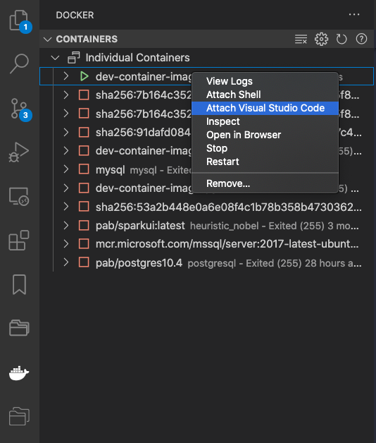

# Development Container

## Windows Prerequisites

### Windows Subsystem for Linux

#### Install WSL

Install WSL 2.0 from the Microsoft Store **or** via **Windows Command Prompt** using the following command:

```
wsl --install
```

In a Windows command prompt run these commands:

```bash
dism.exe /online /enable-feature /featurename:VirtualMachinePlatform /all /norestart
wsl --update
wsl --set-default-version 2
wsl
```

#### Install Ubuntu

From the **WSL terminal** run these commands:

```bash
wsl --install Ubuntu-24.04
wsl --set-default Ubuntu-24.04
wsl --list
```

#### Configure WSL

From the **WSL terminal** run the following command:

```bash
sudo nano /etc/wsl.conf
```

Paste in the following settings, then press ctrl+o then ctrl+x to save and exit nano.

```
[boot]
systemd=true
command="echo nameserver 1.1.1.1 > /etc/resolv.conf && echo nameserver 1.0.0.1 >> /etc/resolv.conf"
[network]
generateResolvConf = false
```

#### Restart WSL

From a normal **Windows Command Prompt** run the following commands:

```
wsl --shutdown
wsl
```

### Docker Install

From the **WSL terminal** follow the instruction via the link below

[Install Docker Engine on Ubuntu](https://docs.docker.com/engine/install/ubuntu/)

From the **WSL terminal** run the following commands:

```
sudo usermod -aG docker $USER
exit
```

#### Restart WSL

From a normal **Windows Command Prompt** run the following commands:

```
wsl --shutdown
wsl
```

## Visual Studio Code

This is optional but recommend for Python Development

Install from [here]([Visual Studio code](https://code.visualstudio.com/))

Install extensions

The first two are required and the rest recommend for Python and Javascript development.

```bash
# Required
code --install-extension ms-azuretools.vscode-docker
code --install-extension ms-vscode-remote.remote-containers
# Recommended
code --install-extension bibhasdn.unique-lines
code --install-extension biomejs.biome
code --install-extension charliermarsh.ruff
code --install-extension eastman.vscode-cfn-nag
code --install-extension esbenp.prettier-vscode
code --install-extension hashicorp.terraform
code --install-extension hashicorp.hcl
code --install-extension kddejong.vscode-cfn-lint
code --install-extension moshfeu.compare-folders
code --install-extension ms-python.black-formatter
code --install-extension ms-python.python
code --install-extension ms-python.vscode-pylance
code --install-extension ms-toolsai.jupyter
code --install-extension oderwat.indent-rainbow
code --install-extension Orta.vscode-jest
code --install-extension ryu1kn.partial-diff
code --install-extension streetsidesoftware.code-spell-checker
code --install-extension thamaraiselvam.remove-blank-lines
code --install-extension wmaurer.change-case
```

Press ctrl+shift+p for command palette and choose "Preferences: Open Settings (JSON)" to edit settings, add the setting below

```json
{
  "remote.containers.gitCredentialHelperConfigLocation": "none"
}
```

## Bootstrap first ever image

From the **WSL terminal** run the following commands:

```
mkdir -p ~/.aws ~/.ssh ~/.zsh-extra
touch .gitconfig
docker run --rm -it --env HOST_USER_HOME=$HOME --mount type=bind,source=/var/run/docker.sock,target=/var/run/docker.sock pabuk/dev-python:3.12 "dc create-dev-container initial-container initial-volume 3.12 .zsh-extra"
```

The initial container will make use of this HOST_USER_NAME variable to mount the key files folders from the correct location.

## Connect to container via terminal

```bash
docker exec -it initial-container zsh
```

## Connect to container via Visual Studio Code

Or use VSCode Docker and Remote Container Extensions to attach VSCode directly into container



## Creating further containers

Once you have a container made from the bootstrap process above you can simply create further containers from within any dev container as below

```bash
dc create-dev-container another-container another-volume 3.12 .zsh-extra
```

Note this does not have to be the same python version as the existing container itself

## Important!

Volume is mounted as `/workspace` files within this directory will be persisted unless you delete the volume, data outside of the workspace directory will be lost if the container is removed or recreated.

Python dependencies are copied across to the volume during first launch and are stored in the directory /workspace/.python/3.x any further packages you install will also be placed here and will be available to any containers with this volume mounted that share the same Python version.

### Stop Container

```bash
docker stop test-container
```

### Start Container

```bash
docker start test-container
```

### Copy files to or from container

```bash
docker cp /wherever/this.txt container-name:/home/dev/

docker cp container-name:/home/dev/this.txt /wherever/
```

### Aliases

Create files containing your aliases (and any other zsh customisation) in `~/.zsh-extra` any files found will be picked up when you next open a terminal.

To persist `~/.zsh-extra` create the files on the host (in WSL if Windows) and add `.zsh-extra` to the very end of any `dc create-dev-container` command you execute to map this directory from the host e.g. `dc create-dev-container container-name volume-name 3.12 .zsh-extra`
