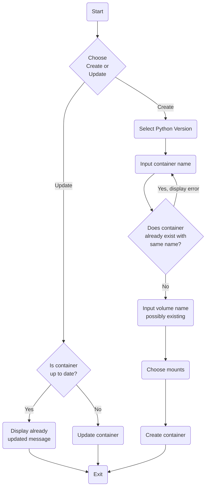

# Dev Container Tool

Flow

```mermaid
graph TD;
    Z(Start)
    A{Choose<br/>Create or<br/>Update}
    B{Is container<br/>up to date?}
    C(Display already<br/>updated message)
    D(Update container)
    E(Exit)
    I(Select Python Version)
    F(Input container name)
    G{Does container<br/>already exist with<br/> same name?}
    H(Input volume name<br/>possibly existing)
    J(Create container)
    K(Choose mounts)

    Z-->A
    A-- Update -->B
    B-- Yes -->C
    C-->E
    B-- No -->D
    D-->E

    A-- Create -->I
    I-->F
    F --> G
    G -- Yes, display error --> F
    G -- No --> H
    H-->K
    K-->J
    J-->E

```
